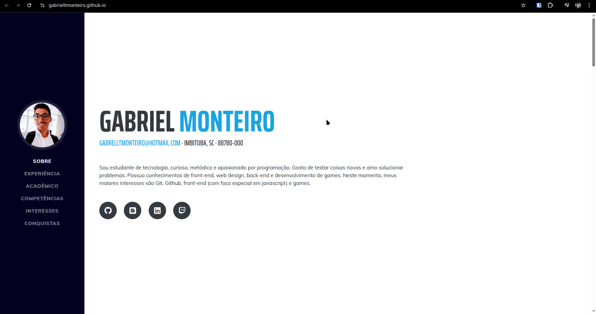

- **Premissa:** Criar site inspirado no portfólio template que está no GitHub, recriar site com menos linhas de código, inteiramente feito por mim. - As cores foram escolhidas por mim, posso copiar
-
- ### **Conteúdo**
  **Atualizar SOBRE**:  inserir conhecimentos, adicionar as tecnologias, ferramentas, arquiteturas, Frameworks e conceitos que mais possuo conhecimento. :: pode ser no início do texto, no corpo do texto em destaque (negrito), ou através dos ícones que os representam, ou uma mesclagem das alternativas (cuidado com o maximalismo).
  **Atualizar experiência**: Preencher atribuições de forma completa, focando em responsabilidades que possam ser interessantes para a vaga pretendida. Registrar a progressão de carreira da empresa {estagiário de suporte, estagiário de suporte nível 2, estagiário de teste de software}
  Atualizar área acadêmica
  **Atualizar acadêmico**:
- 
- ### **Remover/Adicionar itens**
  -Remover endereço e CEP
  -Remover link da Twitch
  +Adicionar Projetos
  +Adicionar Favicon
- ### **Tornar Consistente**
  Garantir que todos os links do site sejam interessantes
  Garantir que clicar no meu e-mail abre o Outlook do visitante em envio de mensagem
- ### **Ideias de Layout. Estrutura Geral**
  Fazer site com `rem` (relativo ao tamanho do monitor)
  Foto mais próxima ao Topo
  Menu alinhado com o conteúdo, SOBRE na linha do nome e conquistas na linha dos ícones
  Aumentar título (Nome) - Talvez colocar nome inteiro
  Aumentar subtítulo
  Aumentar opções do Menu {sobre, experiência, acadêmico, competências, interesses, conquistas}
  Aumentar todos os textos
  Aumentar Ícones
- ### **Ideias de Layout.Detalhes**
  Clicar na foto faz girar igual uma moedinha, pode ser legal trazer 3D e efeito de luz e sombra. Opções: 1.Mostrar Logo do GitHub, Logo do LinkedIn, alternar entre as duas. 2.Foto mais velho, foto com cosplay, eu em pixel art. :: Seja Criativo
  -Pensar
-
-