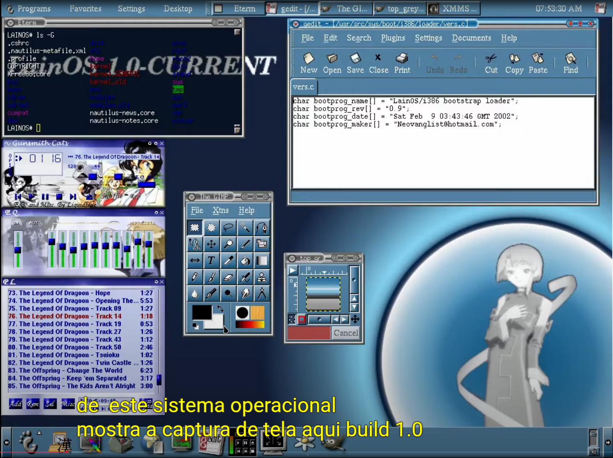

- In the Serial Experiments Lain series, C programming language is ==used in a scene where a teacher copies code onto a chalkboard==.
- **Explanation**
- In the series, a teacher copies C code onto a chalkboard in Layer 01.
- The code uses a yen symbol instead of a backslash in an escape sequence. This is because some Japanese fonts, like UD Digi Kyokasho, render the backslash as a yen symbol.
- Some say that the top line of the code should be "%c>%c¥n" instead of "%c%¥n".
- 
- **More about C**
  C is a general-purpose programming language that was developed by Dennis Ritchie in 1972. It's considered to be the foundation of many modern programming languages, including C++, Java, and C#.
- **Lisp in Serial Experiments Lain**
- The HandiNAVI programming language is a dialect of Lisp.
- The program that Lain types is a simple implementation of Conway's Game of Life in Common Lisp.
- ---
- ### **Layer 01**
  A teacher is seen copying some C code onto the chalkboard in [Layer 01](https://lain.wiki/wiki/Layer_01) just before Lain's fingertips begin to emit [ectoplasm](https://lain.wiki/wiki/Paranormal_Occurrences_in_Serial_Experiments_Lain). It features a yen symbol instead of a backslash in an escape sequence; this is because certain Japanese fonts render the backslash character as the yen symbol, such as the UD Digi Kyokasho font family. It is unclear whether or not this is intentional or holds any significance. Part of the code is not visible because the teacher is standing in the way. It reads as follows:
  ```c
  a='A'; b='B';
  if(a>b) printf("%c>%￥n",/*teacher's head*/);
  if(a==b) printf("%c=% // teacher's shoulders
  if(a<b) printf("%c<%c // teacher's back
  x=321; y=123;
  ```
-
- ### **Layer 04**
  In [Layer 04](https://lain.wiki/wiki/Layer_04), Lain's [NAVI](https://lain.wiki/wiki/NAVI) is shown with a "system console" window open with MIPS-ASM scrolling by.
- **HandiNAVI System Console**
  
-
- ### **Layer 07**
- In [Layer 07](https://lain.wiki/wiki/Layer_07), during class, Lain is surreptitiously working on her **[HandiNAVI](https://lain.wiki/wiki/HandiNAVI)** instead of paying attention. For a few seconds, her NAVI's screen is visible, and we can see her rapidly scroll through two files of Common Lisp source code, named **CRowView.CL** and **Afx-n-nPrv-View.CL**. Text from both of the files are visible in the [game](https://lain.wiki/wiki/Serial_Experiments_Lain_(game)) as well, in the video file Dc1023, "communication."[[1]](http://www.nicovideo.jp/watch/sm685015)**
	- **CRowView.CL** contains code for John Conway's Game of Life.[[2]](http://www.cs.cmu.edu/afs/cs/project/ai-repository/ai/lang/lisp/code/fun/life.cl) The staff probably selected this code because of its seemingly [omnipotent](https://lain.wiki/wiki/God) implications (i.e. creating worlds and life).
	  
	- **Afx-n-nPrv-View.CL** is the source for a code walker.[[3]](http://ftp.sunet.se/pub/lang/lisp/code/codewalk/walk/new_walk.cl) This was probably included for its tongue-in-cheek reference to [Apple](https://lain.wiki/wiki/Apple_Inc._References) in a section of code that is commented out.
	  
	-
- #### FanPages
- [lain.wiki](https://lain.wiki/wiki/Layer_01)
- [SEL.Fandom](https://sel.fandom.com/wiki/Serial_Experiments_Lain_Wiki)
- #### redit
- [LainOSdevelopers](https://www.reddit.com/r/LainOSdevelopers/) - Lain Operating System
- [Lain](https://www.reddit.com/r/Lain/)
- #### LainOS
- First build 1.0
- Project until 2020 is nothing more than a BSD theme with poorly written code
- 
-
- #### The LainOS Project
- New LainOS project
- 
- **youtube**
  {{video https://youtu.be/xmkxAPQZzMU}}
- **github main developers**
- [LainOS.iso](https://github.com/The-LainOS-Project/lainos-iso)
- [The LainOS Project](https://github.com/The-LainOS-Project)
- **Developers** of the new LainOS project
- [amnesia1337](https://github.com/amnesia1337)
- [Axel-DaMage](https://github.com/Axel-DaMage)
-